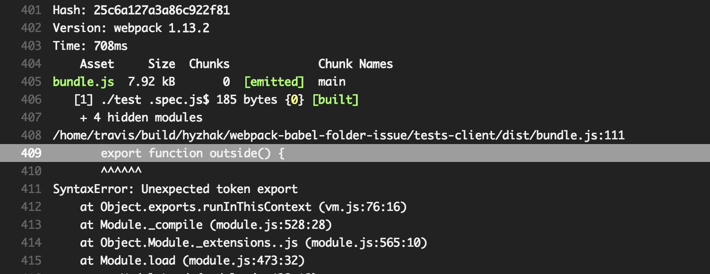

# Webpack + babel sibling directory issue 
 
issue is here [webpack #2936](https://github.com/webpack/webpack/issues/2936)
 
in short if we have all our tests and config in one directory
in our example: `tests-client`. And sources in `src` directory.
Sources outside of `tests-client` won't be processed by babel-loader. 

